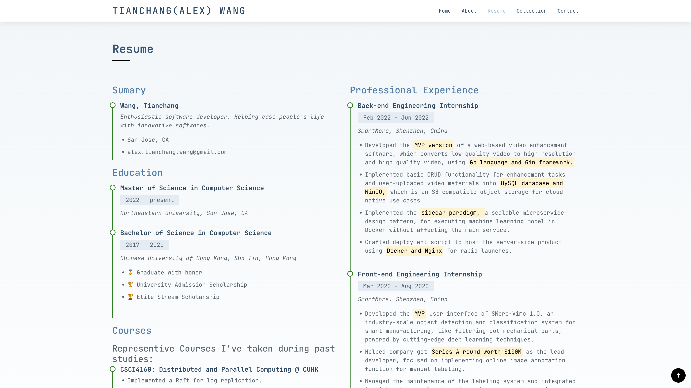

# Tianchang Wang's Personal Website

> Author: Tianchang Wang
>
> Course Link: https://johnguerra.co/classes/webDevelopment_fall_2022/ The **design document** is available [here](./docs/design.pdf).

The page is hosted on [https://chang2000.github.io](https://chang2000.github.io) via Github Pages.

Check out this video for a demo of the website: 

Find the presentation slides here: 

## Project Objective

This personal website is designed as a bridge between me and my potential clients and employers. My skills are listed and are supported by my past experiences. My personal information is also provided for a easier reach out of my potential clients and employers. A secret collection/gallery tab is also provided for inspiration and entertainment.

## Thumbnails

- Hero section  Animation: 

- About section  Click the email icon to email me directly! Your email client will be raised automatically.  Important content are being marked with custom marker pen effect: 
- Resume section 
- Contact section 
- The Collection Gallery  Hover over gallery images to see comment:  Click on the image to enter the gallery. 

## Build

This Project is development under node version `18.9.0`. It's recommended to use a **nodejs version manager**.

1. Clone the project to your local computer.
2. Use `npm install` to install related development dependencies.
3. Use `npm run sass` while developing to keep css file updated.
4. Use `npm run build` to build the whole project.
4. To host this website, setup the root directory to `.` is alright, where the `index.html` resides.

You may also download a release of this project in the release section. 
